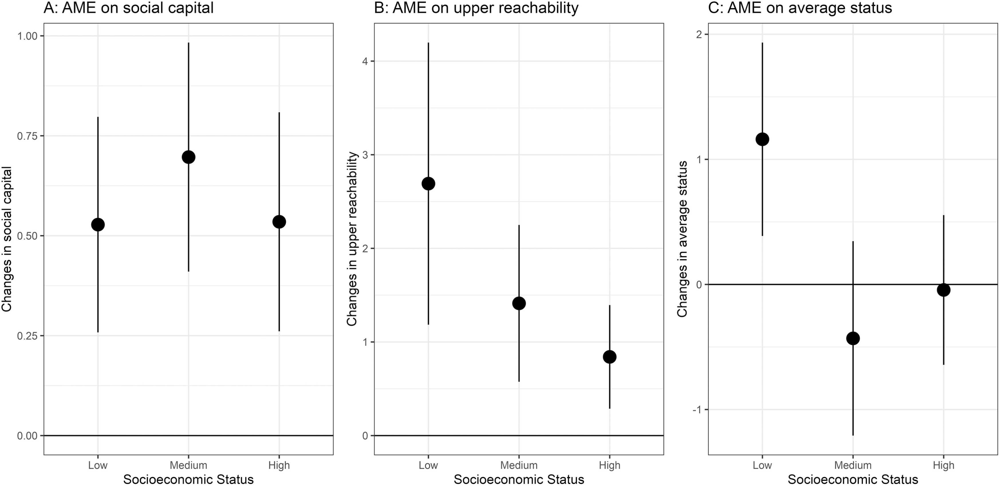
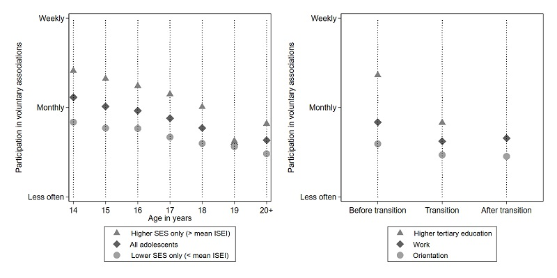
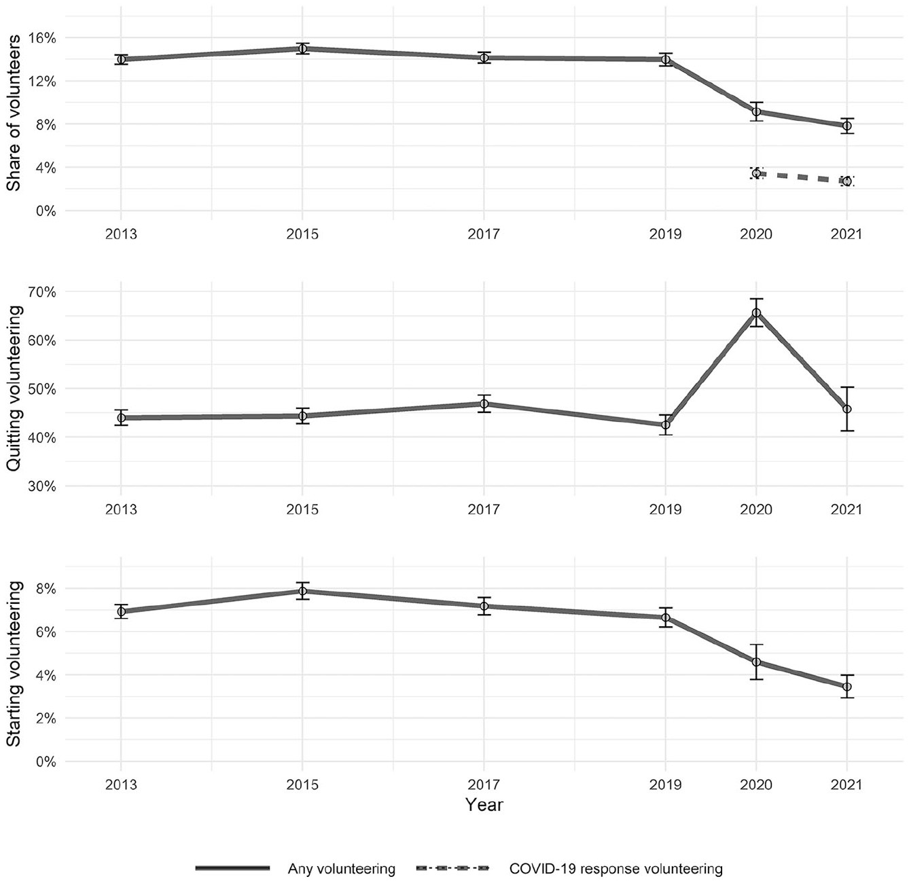

# Dederichs, K ([2024](https://doi.org/10.1016/j.socnet.2023.07.004)) Join to connect? Voluntary involvement, social capital, and socioeconomic inequalities

Access to social capital is stratified by socioeconomic status and has been cross-sectionally linked to involvement in voluntary organizations. Yet, we know little about the origin and interplay of these empirical regularities. Regression analyses on German panel data (SC6-NEPS) reveal that people rich in social capital join organizations more often (selection). Furthermore, joiners access more and higher-status social capital after joining (socializing opportunities). Low-status individuals disproportionally extend their reach towards higher positions through involvement but join less often. Compared to a counterfactual situation in which nobody joins, current involvement patterns marginally reduce some socioeconomic inequalities in access to social capital.

  

# Dederichs, K. and Kruse, H. ([2023](https://academic.oup.com/esr/advance-article-abstract/doi/10.1093/esr/jcac013/6529441)) Who Stays Involved? A Longitudinal Study on Adolescents’ Participation in Voluntary Associations in Germany, European Sociological Review 

The extent to which people are active in voluntary associations varies with age. While previous research provides clear evidence for an inverse u-shaped pattern across an adult’s life, much less is known about the formative period of adolescence and young adulthood. In this article, we examine changes in voluntary participation starting at age 14 and assess the impact of adolescents’ educational transitions and their socioeconomic status. Our analyses rely on longitudinal survey data following a representative sample of adolescents in Germany (N = 5,013) over 6 years. Using fixed effects regression and moderated mediation analyses, we examine how adolescents’ educational transitions and their socioeconomic status drive changes in participation. Results indicate a substantive decline in participation as individuals grow older. Transitions into higher tertiary education partly account for this decline. Finally, we find that adolescents from higher socioeconomic status are especially likely to reduce their participation, in part because they are more likely to undergo transitions into higher tertiary education. These findings suggest that the socioeconomic gap in participation decreases as adolescents grow older. ([code](https://github.com/kasimirdederichs/Who_stays_involved)) 

<iframe width="896" height="504" src="https://www.youtube.com/embed/Dv-OR_WLzwI" title="YouTube video player" frameborder="0" allow="accelerometer; autoplay; clipboard-write; encrypted-media; gyroscope; picture-in-picture" allowfullscreen></iframe>

  

# Dederichs, K. ([2022](https://journals.sagepub.com/doi/full/10.1177/08997640221122814#table-fn2-08997640221122814)) Volunteering in the United Kingdom During the COVID-19 Pandemic: Who Started and Who Quit?, Nonprofit and Voluntary Sector Quarterly 

I examine how volunteering dynamics changed in the United Kingdom during the coronavirus disease 2019 (COVID-19) pandemic relying on data from the “Understanding Society” survey. Descriptive analyses and linear probability models yield three main findings: First, the share of volunteers (for all causes) dropped at least by a third during the first lockdown and did not increase until March 2021. Second, disproportional (absolute) declines occurred among the elderly, women, and those with higher education. Elderly individuals were particularly likely to quit their voluntary engagement, while the propensity of starting declined particularly among higher educated individuals. Third, volunteering in response to COVID-19 was performed by only 3.4% of all respondents and was more common among the higher educated, women, and experienced volunteers. These results suggest that volunteering might well decrease during disasters that affect the opportunities of potential volunteers contrasting the mobilizing role of disasters highlighted by earlier research. ([code](https://github.com/kasimirdederichs/Volunteering_COVID))

